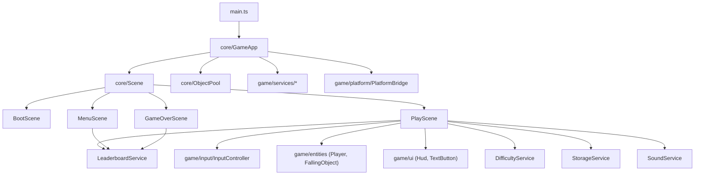

# Pulse Runner (PixiJS + TypeScript)

Instant-game style arcade prototype built with a production-oriented structure:

- Scene-driven architecture (`Boot`, `Menu`, `Play`, `GameOver`)
- Service layer for platform integration, tuning, and persistence
- Reusable input/controller and UI components
- Object pooling for frequently spawned entities
- Persistent local leaderboard (top runs)
- Responsive UI layouts for desktop and mobile
- Pause/resume flow (`Space` / `P` / `Esc` / in-game button)
- Event-driven procedural SFX (no external audio assets)
- Animated level-up feedback (banner + flash + particles + sound)
- Strict TypeScript and unit tests for gameplay tuning logic

## Gameplay

- Avoid red spike enemies
- Collect amber shards to build chain bonuses
- Grab blue boost orbs to activate temporary `shield + frenzy` mode
- Earn near-miss bonuses for risky dodges
- Dynamic level progression: higher levels increase speed and spawn pressure over time
- Game ends when lives reach `0`, then shows `Game Over` modal with `Play Again`
- Local top runs are stored in leaderboard persistence

## Quick Start

```bash
npm install
npm run dev
```

Then open `http://localhost:5173`.

## Scripts

- `npm run dev` - local development server
- `npm run typecheck` - strict TypeScript validation
- `npm run test` - run Vitest unit tests
- `npm run build` - typecheck + production build
- `npm run preview` - preview production build locally

## Controls

- Move: mouse/touch or `Arrow Left/Right` or `A/D`
- Pause/Resume: `Space` / `P` / `Esc` / pause button
- Menu shortcuts:
  - `Enter` / `Space` starts run from menu
  - `Enter` / `Space` replays from game over
  - `M` returns to menu from game over

## Optional URL Params

The platform bridge supports query params:

- `?platform=Discord`
- `?platform=Reddit&user=Alex`

This is useful for host integration testing and score/user reporting stubs.

## Deployment (GitHub Pages)

This project is configured for the repo:

- `https://github.com/abdulsamad245/pulse-runner-html5-game`

Configured files:

- `vite.config.ts` uses `base: "/pulse-runner-html5-game/"`
- `.github/workflows/deploy.yml` deploys `dist` to GitHub Pages
- `.github/workflows/ci.yml` runs `typecheck + test` on pull requests

After pushing to `main`, enable:

- GitHub `Settings` -> `Pages` -> Source: `GitHub Actions`

## Architecture Notes



- `src/core` owns runtime lifecycle and scene switching.
- `src/game/scenes` contains user flow (`Boot -> Menu -> Play -> GameOver`).
- `src/game/services` holds gameplay/domain integrations (difficulty, storage, leaderboard, sound).
- `src/game/platform` isolates host platform behavior behind an interface.
- `src/game/entities`, `input`, and `ui` are reusable gameplay building blocks.

This layout is intentionally ready for SDK integrations and shared game libraries across platform targets.
